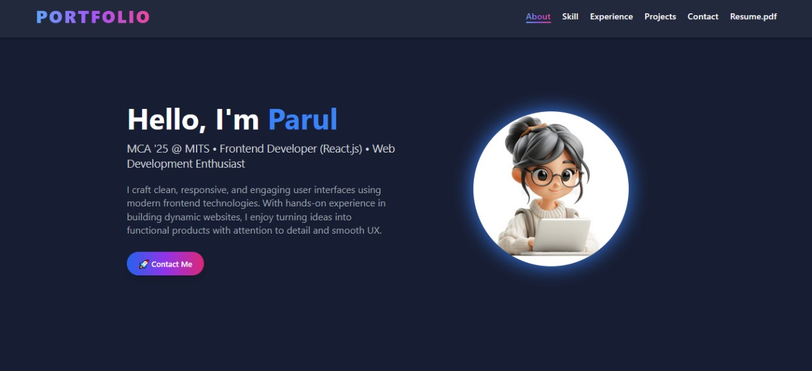
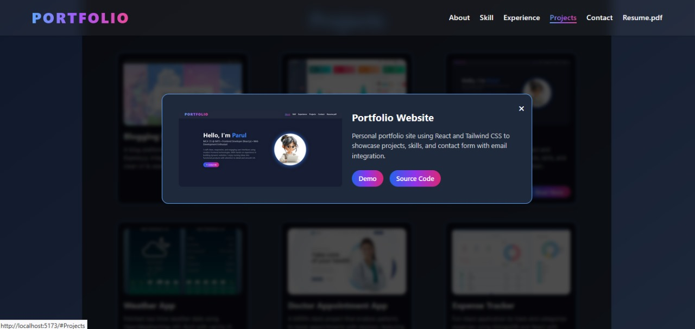

# 🚀 React Portfolio Website

A modern and responsive portfolio web app built using **React**, **Tailwind CSS**, and **Vite**. It showcases your projects, skills, experiences, and includes a contact form — all in a stylish, animated, and smooth interface.

## 📸 Screenshots

### 🌟 Homepage


### 💬 Full project


### 💬 Project


### 💬 Project Popup


---

## 🔧 Tech Stack Used

- ⚛️ React.js – Frontend UI Framework
- 💨 Tailwind CSS – For styling and responsiveness
- ⚡ Vite – Fast build tool and dev server
- 🖼️ React Icons – For modern icons
- 🎨 Gradient Buttons, Hover Effects, Smooth Animations

---

## 🔗 Live Demo

👉 **Check it out live here**: [https://your-username.github.io/react-portfolio](https://your-username.github.io/react-portfolio)

(Replace with your actual GitHub Pages or Netlify link if hosted)

---

## 📂 Features

- Clean and colorful design
- Responsive layout for mobile and desktop
- Projects section with popup preview modal
- Contact form with icons and gradient button
- Interactive navbar with gradient hover effects
- Dark glass background with blur and shadow effects

---

## 💡 How to Run

```bash
git clone https://github.com/Parul-Guptaa/react-portfolio.git
cd react-portfolio
npm install
npm run dev
